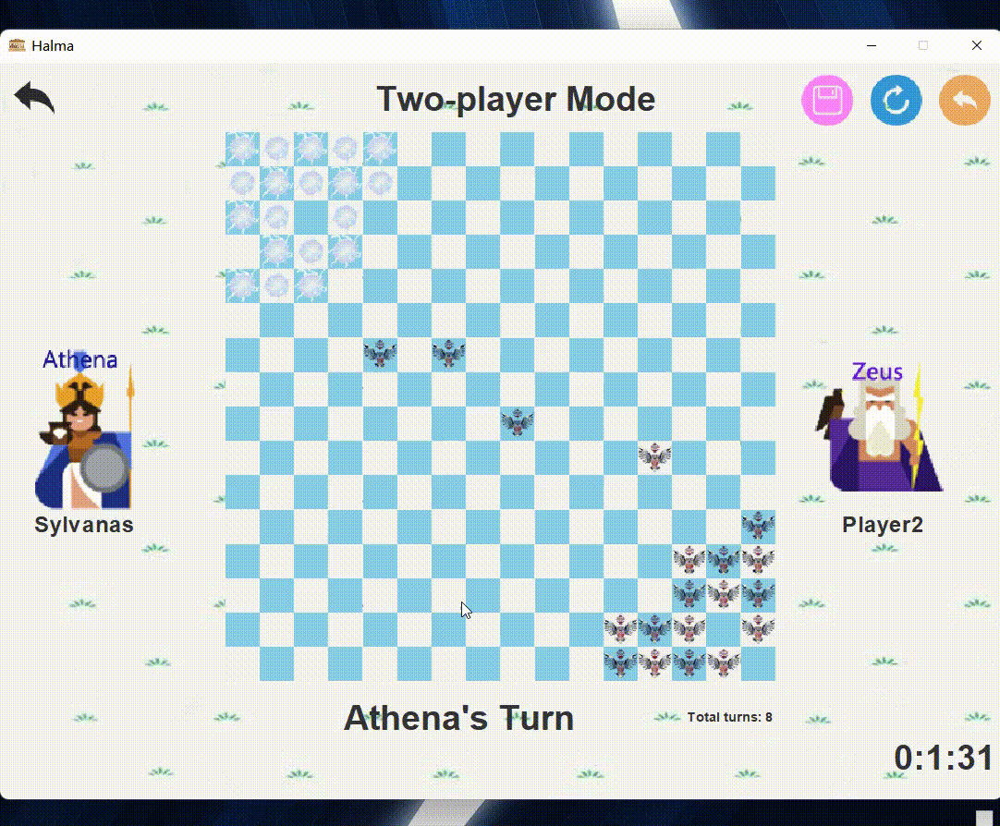

# Halma

> Project of *Introduction of Computer Programming A* course in SUSTech in 2020 spring semester. TAs of the course implemented a simple chessboard of Halma, and we added functions and a theme.
> 

Our Halma is in the Greek theme and players can choose one of Greek gods to play the game. We provide 2-player and 4-player modes and only support local game. 

The project is written in **Java**; UI is implemented by **Java Swing**; picture materials of UI are from the Internet.

| teammates        | work                                                         |
| ---------------- | ------------------------------------------------------------ |
| **Ruihao Zhang** | designed the structure of the project, load and save game, ranking list, UI |
| **Yiqi Liu**     | implemented basic rules of the game, undo                    |

## Quick Start

Two ways to start

- run `Halma.exe` directly

  You may need to set `EXE4J_JAVA_HOME` environment variable.

- run source code `Halma.java` (`src/xyz/chengzi/halma/Halma.java`)

## Showcase

The whole picture:

### Characters

Players can act as one of Greek gods to play the game. Different characters have different chesses.

### Play the game

The game provides 2-player and 4-player mode.

Finish a game:

### Others

**Ranking list**

